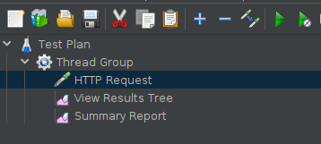
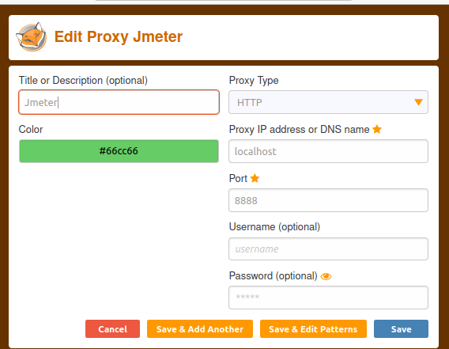

## Prepare Jmeter Instance

### Pre-Request Softwares
* [Download & Install JDK](https://www.oracle.com/java/technologies/javase/jdk11-archive-downloads.html)
* [Download & extract JMeter Binaries Zip](https://jmeter.apache.org/download_jmeter.cgi)
* Set environment variable(path) -  Set JAVA_HOME

### Open Jmeter GUI to create Script
* Browse to Jmeter bin folder
  - Window click on - **ApacheJMeter.jar**
  - Linux run command in Terminal - **./jmeter**
* create Simple Script
  - Add **Thread Group** Under **Test Plan**
    - Add **HTTP Request** Sampler
    - Add **View Results Tree** listener
    - Add **Summary Report** Summary Report
   

### Meter HTTP(S) Test Script Recorder
* [Add FoxyProxy FireFox Standard extension for Jmeter Recording](https://addons.mozilla.org/en-US/firefox/addon/foxyproxy-standard/)
  - Add Proxy
    - Add **localhost** as Proxy IP address or DNS name value
    - Add **8888** Port value
    - Click **Save**
 
   

* [JMeter configuration for Script Recording ](https://jmeter.apache.org/usermanual/jmeter_proxy_step_by_step.html)
* HTTP(S) Test Script Recorder - Test Plan Creation
    -  Select Target Controller (Select Created Thread Group)

* HTTP(S) Test Script Recorder - Requests Filtering
- Add **URL Patterns to Include** which want to record   
    - .\*IP or Domain.\* Example : .\*opensource-demo.orangehrmlive.com.\*
  - Add **URL Patterns to Exclude** which don't want to record
    - (?i).\*\\.(bmp|css|js|gif|ico|jpe?g|png|swf|woff|woff2|ttf)(.*)(?i).*\.(bmp|css|js|gif|ico|jpe?g|png|swf|woff|woff2|ttf)(.\*)